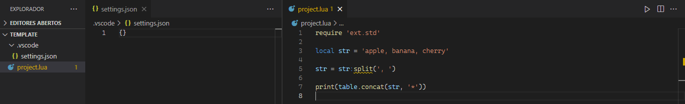
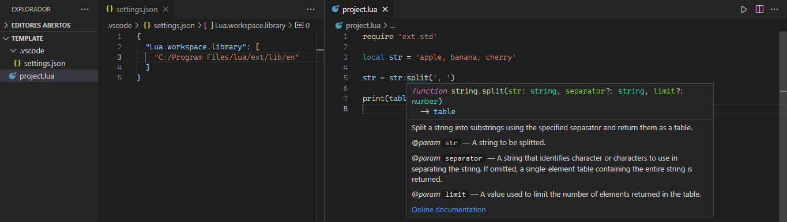
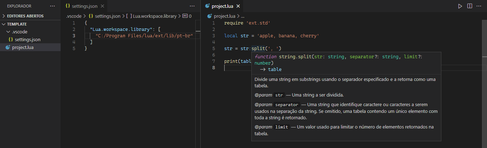

[//]: # (author: Josélio Júnior <joseliojrx25@gmail.com>)
[//]: # (copyright: Josélio Júnior 2022)
[//]: # (license: MIT)

# Lua extensions documentation &nbsp;

### Index
* [Installation on Visual Studio Code](#installation)
* [Windows 7 or higher terminal UTF8 support](#win-uft8)
* [string](#string)
  * [slice( )](#string-slice)
  * [split( )](#string-split)
  * [replace( )](#string-replace)
  * [toLowerCase( )](#string-tolowercase)
  * [toUpperCase( )](#string-touppercase)
* [table](#table)
  * [slice( )](#table-slice)
  * [reduce( )](#table-reduce)
  * [reverse( )](#table-reverse)

<h2 name="installation" align="center">
  Installation on Visual Studio Code
</h2>

&nbsp; This section will guide you through the installation of the extension modules and IntelliSense activation in VS Code.

&nbsp; In order to make the documentation synchronize to IntelliSense you will need [**VSCode Lua**](https://github.com/sumneko/vscode-lua) extension installed. See also in [**VSCode Marketplace**](https://marketplace.visualstudio.com/items?itemName=sumneko.lua).

### Install
&nbsp; Fork and/or clone this repository and inside `install` you will see the `ext` directory. Then, copy `ext` and paste into your `lua` main directory. See the example on Windows:

> *Copy the* `ext` *directory.*
~~~
~/lua-extensions/install/ext

lua-extensions
  └ install
     └> ext  (copy)
~~~
> *Paste into* `lua` *main directory.*
~~~
C:/Program Files/lua  ▶  C:/Program Files/lua/ext

 C
 └ Program Files
    └ lua
       ├ lua.exe
       ├ lua54.dll
       ├ luac.exe
       └> ext  (paste)
~~~

### VS Code IntelliSense activation
&nbsp; Inside your project create the `.vscode` directory and a `settings.json` file within.

~~~
~/project  ▶  ~/project/.vscode/settings.json

project
 ├ test.lua
 └> .vscode
      └> settings.json
~~~

&nbsp; To activate IntelliSense, write those settings inside `settings.json`. See the examples below where the `lua` main path is `C:/Program Files/lua/`:

#### English documentation
> *settings.json* 
~~~json
{
  "Lua.workspace.library": [
    "C:/Program Files/lua/ext/lib/en"
  ]
}
~~~

#### Portuguese of Brazil documentation
> *settings.json* 
~~~json
{
  "Lua.workspace.library": [
    "C:/Program Files/lua/ext/lib/pt-br"
  ]
}
~~~

&nbsp; To confirm that everything will be applied, reload the VS Code window and then you should see the documentation when you hover the method.

&nbsp; If you want, you can copy this [**template**](../template) directory and test.

#### Screenshots
> *IntelliSense off*

> *IntelliSense on - English*

> *IntelliSense on - Portuguese of Brazil*

[**back to top ▲**](#top)

---

<h2 name="win-utf8" align="center">
  Windows 7 or higher terminal UTF8 support
</h2>

&nbsp; When using Windows you may notice some issues in characters print. Here goes some ways to fix this.

> *Problem*
~~~lua
require 'ext.std'

local str = 'maçã'
str = table.concat(str:split(''), ', ')

print(str) -- m, a, ç, ã
~~~

> *CMD fix*

&nbsp; Open a new CMD window and type the command below to show UTF8 characters on terminal.

~~~powershell
chcp 65001
~~~

&nbsp; Now when you try to print in `Lua` you should receive this:

~~~lua
-- CMD
require 'ext.std'

local str = 'maçã'
str = table.concat(str:split(''), ', ')

print(str) -- m, a, ç, ã
~~~

> *Code Runner fix*

&nbsp; In VS Code with [*Code Runner*](https://marketplace.visualstudio.com/items?itemName=formulahendry.code-runner) you can run ` Ctrl + Alt + N ` to print the output as regular UTF8 string.
~~~lua
-- VS Code - Code Runner
require 'ext.std'

local str = 'maçã'
str = table.concat(str:split(''), ', ')

print(str) -- m, a, ç, ã
~~~

> *Temporary file fix*

&nbsp; You can also write a temporary file to double-check.
~~~lua
require 'ext.std'

local str = 'maçã'

str = table.concat(str:split(''), ', ')

io.open('./temp.txt', 'w')
  :write(str)
  :close()
~~~

> *temp.txt*
~~~txt
m, a, ç, ã
~~~

[**back to top ▲**](#top)

---

<h1 name="string" align="center">
  string
</h1>

###  Require module
~~~lua
require 'ext.std'    --> all extension modules
require 'ext.string' --> string module only
~~~

<h2 name="string-slice">
  string.slice( )
</h2>

&nbsp; Returns a section of a string.

####  Syntax
~~~lua
string.slice(str[, i [, j]])
~~~

####  Parameters
`str` *&lt;string&gt;* - The string to be sliced.

`i` *&lt;number?&gt;* - The index to the beginning of the specified portion of string.

`j` *&lt;number?&gt;* - The end to the beginning of the specified portion of string. If this value is not specified, the substring continues to the end of string.

### Usage

#### UTF8 support comparison between `string.slice( )` and `string.sub( )`

~~~lua
require 'ext.std'

local text = 'maçã'

print(text:slice(3))     --> çã
print(text:sub(3))       --> çã

print(text:slice(3, 3))  --> ç
print(text:sub(3, 3))    --> �

print(text:slice(4))     --> ã
print(text:sub(4))       --> �ã

print(text:slice(2, 3))  --> aç
print(text:sub(2, 3))    --> a�

print(text:slice(-1))    --> ã
print(text:sub(-1))      --> �

local emoji = '😎🤩💀😺'

print(emoji:slice(3)) --> 💀😺
print(emoji:sub(3))   --> 🤩💀😺

print(emoji:slice(1, 1)) --> 😎
print(emoji:sub(1, 1))   --> �
~~~

#### Less error possibilities
~~~lua
require 'ext.std'

local text = 'maçã'

print(text:slice())   --> maçã
print(text:sub())     --> error

print(string.slice()) --> type error
print(string.sub())   --> error
~~~

#### Considerations
&nbsp; This method is equivalent to `string.sub( )` of `Lua`, but with UTF8 support.

[**back to top ▲**](#top)

<h2 name="string-split">
  string.split( )
</h2>

&nbsp; Splits a string into substrings using the specified separator and return them as a table.

####  Syntax
~~~lua
string.split(str, separator [, limit])
~~~

####  Parameters
`str` *&lt;string&gt;* - The string to be splitted.

`separator` *&lt;string&gt;* - A string that identifies character or characters to use in separating the string. If omitted, a single-element table containing the entire string is returned.

`limit` *&lt;number?&gt;* - A value used to limit the number of elements returned in the table.

### Usage

####  Long syntax
~~~lua
require 'ext.std'

local str = 'apple,tomato,strawberry'  --> <string>
str = string.split(str, ',')           --> <table>
str = table.concat(str, ' - ')         --> <string>

print(str)  -- apple - tomato - strawberry
~~~

####  Short syntax
~~~lua
require 'ext.std'

local str = 'apple,tomato,strawberry'  --> <string>
str = str:split(',')                   --> <table>
str = table.concat(str, ' * ')         --> <string>

print(str) -- apple * tomato * strawberry
~~~

####  UTF8 support
~~~lua
require 'ext.std'

local strEN = 'apple'
local strPT = 'maçã'
local strRU = 'яблоко'
local strJP = 'りんご'
local sym = '😶🤩😶😶🤩😶😶🤩😶'

print(table.concat(strEN:split(''), ', '))     --> a, p, p, l, e
print(table.concat(strPT:split(''), ', '))     --> m, a, ç, ã
print(table.concat(strRU:split(''), ', '))     --> я, б, л, о, к, о
print(table.concat(strJP:split(''), ', '))     --> り, ん, ご
print(table.concat(sym:split('😶😶'), ', '))  --> 😶🤩,	🤩,	🤩😶

-- Using limit parameter
print(table.concat(strEN:split('', 2), ', '))     --> a, p
print(table.concat(strPT:split('', 3), ', '))     --> m, a, ç
print(table.concat(strRU:split('', 5), ', '))     --> я, б, л, о, к
print(table.concat(strJP:split('', 1), ', '))     --> り
print(table.concat(sym:split('😶😶', 2), ', '))  --> 😶🤩,	🤩
~~~

####  No magic symbols
~~~lua
require 'ext.std'

local sym = '1%?[00^~@%?[^9043],%?kty567'

print(table.concat(sym:split('%?')))  --> 1, [00^~@, [^9043],, kty567 }
print(table.concat(sym:split()))      --> 1%?[00^~@%?[^9043],%?kty567 }
~~~

####  Big separator
~~~lua
require 'ext.std'

local str = 'nópéróõmopóõpghnonóõppopkóp'

print(table.concat(str:split('óõp'), ', '))  --> nópéróõmop, ghnon, popkóp
~~~

####  Using number and boolean as separator
~~~lua
require 'ext.std'

local strN = 'n9493fj39fj49jf93jf93j4f93j9fj3'
local strB = 'n949truefj49jf93jtruej4f93j9fj3'

print(table.concat(strN:split(93), ', '))   --> n94, fj39fj49jf, jf, j4f, j9fj3
print(table.concat(strB:split(true), ', ')) --> n949, fj49jf93j, j4f93j9fj3
~~~

####  Considerations
&nbsp; This string method was based on `String.split( )` of `JavaScript`.

[**back to top ▲**](#top)

<h2 name="string-replace">
  string.replace( )
</h2>

&nbsp; Replaces text in a string, using a search string.

####  Syntax
~~~lua
string.replace(str[, searchValue [, replaceValue]])
~~~

####  Parameters
`str` *&lt;string&gt;* - The string to be manipulated.

`searchValue` *&lt;string?&gt;* - A string to search for.

`replaceValue` *&lt;string?&gt;* - A string containing the text to replace for every successful match of `searchValue`.

### Usage

#### No magic symbols
~~~lua
require 'ext.std'

local text = '[Box]'

print(text:replace('[', '')) --> Box]
print(text:gsub('[', ''))    --> error
~~~

#### Less error possibilities
~~~lua
require 'ext.std'

local text = '[Box]'

print(text:replace('x')) --> [Box]
print(text:gsub('x'))    --> error

print(text:replace())    --> [Box]
print(text:gsub())       --> error

print(string.replace())  --> type error
print(string.gsub())     --> error

text = 'Age: 50? -> ok'

print(text:replace(50, 31))      --> Age: 31? -> ok
print(text:gsub(50, 31))         --> Age: 31? -> ok

print(text:replace('ok', true))  --> Age: 50? -> true
print(text:gsub('ok', true))     --> error

print(text:replace('ok', false)) --> Age: 50? -> false
print(text:gsub('ok', false))    --> error
~~~

#### Considerations
&nbsp; This method is equivalent to `string.gsub( )` of `Lua`, but without pattern search.

[**back to top ▲**](#top)

<h2 name="string-tolowercase">
  string.toLowerCase( )
</h2>

&nbsp; Returns a copy of this string with all letters in lower case.

####  Syntax
~~~lua
string.toLowerCase(str)
~~~

####  Parameters
`str` *&lt;string&gt;* - The string to be in lower case.

### Usage

#### Comparison to `string.lower()`
~~~lua
require 'ext.std'

local str = 'MAÇÃ, APPLE OR ЯБЛОКО'

print(str:toLowerCase()) --> maçã, apple or яблоко
print(str:lower())       --> maÇÃ, apple or ЯБЛОКО
~~~

#### Considerations
&nbsp; This method is equivalent to `string.lower( )` of `Lua`, but with support to UTF8 characters.

[**back to top ▲**](#top)

<h2 name="string-touppercase">
  string.toUpperCase( )
</h2>

&nbsp; Returns a copy of this string with all letters in upper case.

####  Syntax
~~~lua
string.toUpperCase(str)
~~~

####  Parameters
`str` *&lt;string&gt;* - The string to be in upper case.

### Usage

#### Comparison to `string.upper()`
~~~lua
require 'ext.std'

local str = 'maçã, apple or яблоко'

print(str:toUpperCase()) --> MAÇÃ, APPLE OR ЯБЛОКО
print(str:upper())       --> MAçã, APPLE OR яблоко
~~~

#### Considerations
&nbsp; This method is equivalent to `string.upper( )` of `Lua`, but with support to UTF8 characters.

[**back to top ▲**](#top)

---

<h1 name="table" align="center">
  table
</h1>

###  Require module
~~~lua
require 'ext.std'    --> all extension modules
require 'ext.table'  --> table module only
~~~

<h2 name="table-reduce">
  table.reduce( )
</h2>

&nbsp; Returns the accumulated result of all elements in the table.

####  Syntax
~~~lua
table.reduce(list, operator)
~~~

####  Parameters
`list` *&lt;table&gt;* - A table of numbers and/or number-like elements.

`operator` - The operation symbol to be executed.

&nbsp;&nbsp;&nbsp; `+` &nbsp; addition

&nbsp;&nbsp;&nbsp; `-` &nbsp; subtraction

&nbsp;&nbsp;&nbsp; `*` &nbsp; multiplication

&nbsp;&nbsp;&nbsp; `/` &nbsp; float division

&nbsp;&nbsp;&nbsp; `//`&nbsp; floor division

&nbsp;&nbsp;&nbsp; `%` &nbsp; modulo

&nbsp;&nbsp;&nbsp; `^` &nbsp; exponentiation

### Usage

####  Easy sum
~~~lua
require 'ext.std'

local list = { 4, 2, 3, 1, 9 }
print(table.reduce(list, '+')) --> 19

-- is equivalent to
local a = list[1] + list[2] + list[3] + list[4] + list[5]
print(a) --> 19

-- is equivalent to
local b = 4 + 2 + 3 + 1 + 9
print(b) --> 19
~~~

####  All operators
~~~lua
require 'ext.std'

local list = { 2, 2, 2 }

print(table.reduce(list, '+'))  --> 2 + 2 + 2 = 6
print(table.reduce(list, '-'))  --> 2 - 2 - 2 = -2
print(table.reduce(list, '*'))  --> 2 * 2 * 2 = 8
print(table.reduce(list, '/'))  --> 2 / 2 / 2 = 0.5
print(table.reduce(list, '//')) --> 2 // 2 // 2 = 0
print(table.reduce(list, '^'))  --> 2 ^ 2 ^ 2 = 16.0
print(table.reduce(list, '%'))  --> 2 % 2 % 2 = 0
~~~

####  Table of numbers
~~~lua
require 'ext.std'

local list = { 1, 2, 3, 4, 5, 6, 7, 8, 9 }

print(table.reduce(list, '+'))  --> 45
print(table.reduce(list, '-'))  --> -43
print(table.reduce(list, '*'))  --> 362880
print(table.reduce(list, '/'))  --> 2.7557319223986e-06
print(table.reduce(list, '//')) --> 0
print(table.reduce(list, '%'))  --> 1
print(table.reduce(list, '^'))  --> 1.0
~~~

####  Table with booleans
&nbsp; In this case of booleans inside the `table`, they will be considered as numbers, where `true` will be 1 and `false` will be 0.

~~~lua
require 'ext.std'

-- equivalent to { 0, 1, 5, 4.9 }
local mixedList = { false, true, 5, 4.9 }

print(table.reduce(mixedList, '+'))  --> 10.9
print(table.reduce(mixedList, '-'))  --> -10.9
print(table.reduce(mixedList, '*'))  --> 0.0
print(table.reduce(mixedList, '/'))  --> 0.0
print(table.reduce(mixedList, '//')) --> 0.0
print(table.reduce(mixedList, '%'))  --> 0.0
print(table.reduce(mixedList, '^'))  --> 0.0

--[[
    This method does not make any changes to table
    elements values, so they will remain the same 
    after the usage.
]] 

print(mixedList[2]) -- true
print(mixedList[3]) -- 5
~~~

####  Table with strings
&nbsp; Any string value inside the `table` that are not convertible to `number` makes this method to return `nan`.

~~~lua
require 'ext.std'

-- It will not be equivalent to number.
local strList = { 'a', 'b', 'c', 'd' }

print(table.reduce(strList, '+')) --> nan
print(table.reduce(strList, '-')) --> nan

-- It will not be equivalent to number.
local numStr = { 'false', 2, 5.0, 3, 'true' }

print(table.reduce(numStr, '+')) --> nan
print(table.reduce(numStr, '-')) --> nan

-- It will be equivalent to number.
local numStrNum = { '42', 2, 5.0, 3 }

print(table.reduce(numStrNum, '+')) --> 52.0
print(table.reduce(numStrNum, '-')) --> 32.0
print(table.reduce(numStrNum, '^')) --> 4.9828603059828e+48
~~~

####  Nil element
&nbsp; Any `nil` element inside the table makes this method to return `nil`.

~~~lua
require 'ext.std'

local nilList = { false, 22.0, nil, 5, 4.9 }
print(table.reduce(nilList, '+')) --> nil
~~~

####  Considerations
&nbsp; This table method was based on `Array.reduce( )` of `JavaScript`.

[**back to top ▲**](#top)

<h2 name="table-reverse">
  table.reverse( )
</h2>
&nbsp; This method mutates the table received and returns a reversed version of the same table.

####  Syntax
~~~lua
table.reverse(list)
~~~

####  Parameters
`list` *&lt;table&gt;* - A table of elements.

### Usage

#### Regular usage
~~~lua
require 'ext.std'

local mixedList = { 'A', 'B', 'C', false, true, 2, 56.3, '23' }

print(table.unpack(mixedList)) --> 'A'  'B'  'C'  false  true  2  56.3  '23'
table.reverse(mixedList)       --> reversing
print(table.unpack(mixedList)) --> '23'  56.3  2  true  false  'C'  'B'  'A'
~~~

### Nil element
&nbsp; Any `nil` value inside the table makes this method to return `nil`, eventually the table will not be reversed.

~~~lua
require 'ext.std'

local mixedList = { 'A', 'B', 'C', nil, 2, 56.3, '23' }

print(table.unpack(mixedList)) --> 'A'  'B'  'C'  nil  2  56.3  '23'
table.reverse(mixedList)       --> remains in the same order
print(table.unpack(mixedList)) --> 'A'  'B'  'C'  nil  2  56.3  '23'
~~~

####  Considerations
&nbsp; This table method was based on `string.reverse( )` of `Lua` and `Array.reverse( )` of `JavaScript`.

[**back to top ▲**](#top)

<h2 name="table-slice">
  table.slice( )
</h2>

&nbsp; Returns a section of a table.

####  Syntax
~~~lua
table.slice(list[, i [, j]])
~~~

####  Parameters
`list` *&lt;table&gt;* - The table to be sliced.

`i` *&lt;number?&gt;* - The index to the beginning of the specified portion of table.

`j` *&lt;number?&gt;* - The end to the beginning of the specified portion of table. If this value is not specified, the element continues to the end of table.

### Usage

#### Regular usage

~~~lua
require 'ext.std'

local t = { 'text', 4, 5.6, nil, false, true }
local tr

tr = table.slice(t)
print(table.unpack(tr))  --> text 4 5.6 nil false true

tr = table.slice(t, 2)
print(table.unpack(tr))  --> 4 5.6 nil false true

tr = table.slice(t, 3, 5)
print(table.unpack(tr))  --> 5.6 nil false

tr = table.slice(t, -2)
print(table.unpack(tr))  --> false true

tr = table.slice()
print(table.unpack(tr))  --> type error
~~~

#### Considerations
&nbsp; This table method was based on `Array.slice( )` of `JavaScript`.

---

Made with ❤️ by me.

**Josélio Júnior - 2022**

---
